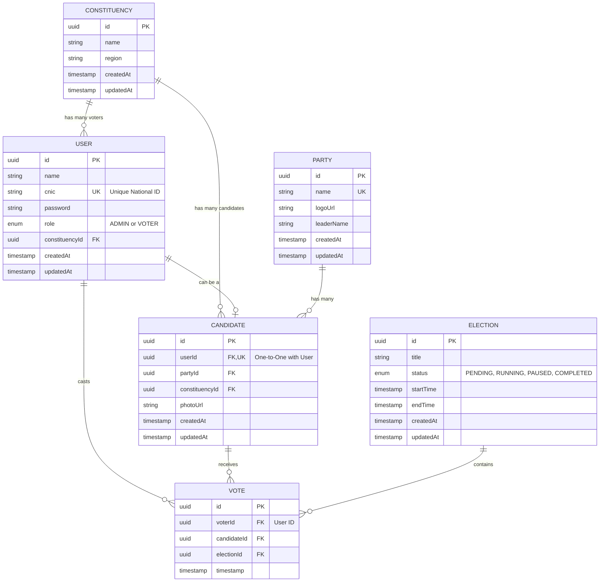

# Election Management System (EMS) - Database Schema Overview

The database for the Election Management System (EMS) is designed using **TypeORM** (with PostgreSQL) and follows a relational model. Below is an overview of the schema design, including an Entity-Relationship (ER) diagram, and the reasoning behind the architectural choices.

## Entity-Relationship Diagram

## Entities & Design Rationale

### 1. `User` Entity
*   **Purpose:** Represents all individuals interacting with the system, primarily Voters and Administrators.
*   **Key Fields:** `id`, `name`, `cnic` (unique), `password`, `role` (ADMIN, VOTER).
*   **Rationale:** We use a centralized `User` table to manage authentication. The `cnic` (Computerized National Identity Card) acts as a strictly unique identifier, which is critical in an election context to prevent duplicate accounts. The `role` enum defines permissions, ensuring separation between regular voters and system administrators.

### 2. `Constituency` Entity
*   **Purpose:** Represents geographic or administrative regions where elections take place.
*   **Key Fields:** `id`, `name`, `region`.
*   **Rationale:** By decoupling `Constituency` into its own entity, we can easily link multiple `Users` (Voters) and `Candidates` to a specific area. This allows the system to enforce rules like "Voters can only view/vote for candidates in their own constituency."

### 3. `Candidate` Entity
*   **Purpose:** Represents individuals running for office in an election.
*   **Key Fields:** `id`, `photoUrl`.
*   **Relationships:**
    *   **One-to-One with `User`:** A candidate is also a user/citizen in the system. Linking them ensures they share the same fundamental identity data (like CNIC) without duplicating records.
    *   **Many-to-One with `Party` & `Constituency`:** Links the candidate to their political affiliation and the area they are contesting.
*   **Rationale:** Separating `Candidate` from `User` ensures that candidate-specific data (like `party`, `photoUrl`, and `votes` received) doesn't bloat the `User` table, keeping the schema normalized.

### 4. `Party` Entity
*   **Purpose:** Represents political parties that candidates belong to.
*   **Key Fields:** `id`, `name` (unique), `logoUrl`, `leaderName`.
*   **Rationale:** Centralizes party information. If a party changes its logo or leader, it only needs to be updated in one place, instantly reflecting across all associated candidates.

### 5. `Election` Entity
*   **Purpose:** Defines a specific voting event.
*   **Key Fields:** `id`, `title`, `status` (PENDING, RUNNING, PAUSED, COMPLETED), `startTime`, `endTime`.
*   **Rationale:** The `status` enum acts as a powerful state machine for the application logic. The backend can easily prevent voting if the election status is not `RUNNING` or if the current time is outside the `startTime` and `endTime`.

### 6. `Vote` Entity
*   **Purpose:** The transactional core of the system, recording individual ballots cast.
*   **Key Fields:** `id`, `timestamp`.
*   **Relationships:** Belongs to a `voter` (User), a `candidate`, and an `election`.
*   **Critical Design Choice:**
    *   **Unique Constraint:** A `@Unique(['voter', 'election'])` constraint is enforced at the database level.
    *   **Rationale:** This is the most important security feature of the schema. By enforcing uniqueness on the combination of `voter` and `election`, the database mathematically guarantees that a single voter can *never* cast more than one vote in the same election, providing a robust defense against multiple voting attempts or concurrency issues.
